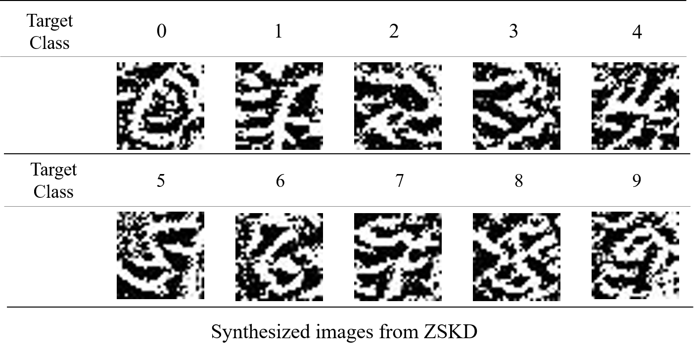

# Zero-Shot Knowledge Distillation in Deep Networks Pytorch


:star: Star us on GitHub — it helps!!

PyTorch implementation for *[Zero-Shot Knowledge Distillation in Deep Networks](https://arxiv.org/abs/1905.08114)*


## Install

You will need a machine with a GPU and CUDA installed.  
Then, you prepare runtime environment:

   ```shell
   pip install -r requirements.txt
   ```


## Use

For mnist dataset,

```shell
python main.py --dataset=mnist --t_train=False --num_sample=12000 --batch_size=200 
```

For cifar10 dataset,

```shell
python main.py --dataset=cifar10 --t_train=False --num_sample=24000 --batch_size=100
```


Arguments:

- `dataset` - available dataset: ['mnist', 'cifar10', 'cifar100']
- `t_train` - Train teacher network?? 
	- if True, train teacher network
	- elif False, load trained teacher network
- `num_sample` - Number of DIs crafted per category
- `beta` - Beta scaling vectors
- `batch_size` - batch size
- `lr` - learning rate
- `iters` - iteration number
- `s_save_path` - save path for student network
- `do_genimgs` - generate synthesized images from ZSKD??
	- if True, generate images
	- elif False, you must have the synthesized images that are generated from ZSKD


## Result examples for MNIST dataset




## Understanding this method(algorithm)

:white_check_mark: Check my blog!!
[Here](https://da2so.github.io/2020-08-12-Zero_Shot_Knowledge_Distillation_in_Deep_Networks/)